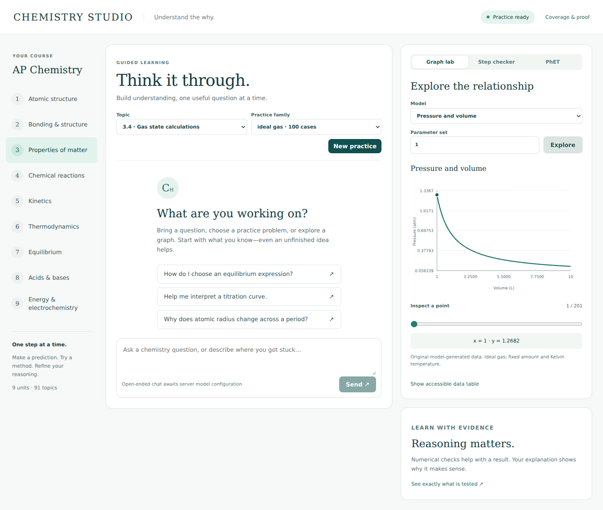
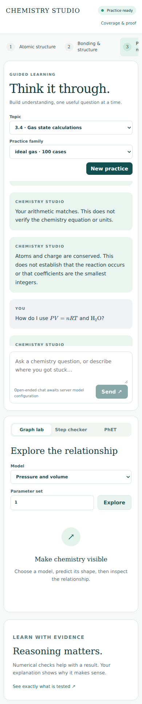

# Interface and software verification

Tested September 10, 2026. This report describes a local application test, not live-model or expert chemistry validation.

## Environment and flow

The flow under test was: load the app → explore a graph → inspect coordinates and table → start practice → request hints and submit a wrong result → end practice → check arithmetic and an ionic equation → render math → inspect coverage → use the mobile layout.

React production build, Python loopback server, Chromium through Playwright. Desktop viewport: 1440 × 1000. Mobile viewport: 390 × 844. URL used inside the test environment: `http://127.0.0.1:8001/`.

The cloud Browser plugin returned `ERR_BLOCKED_BY_CLIENT` for localhost. The frontend-building workflow permits a local Playwright fallback for that blocker. The normal Chromium download also timed out; a packaged Chromium binary from npm was used instead. The application and browser were launched together so they shared the same loopback network. This is a test-environment detail, not a requirement for end users.

## Checks

| Check | Result | Evidence |
|---|---|---|
| Page identity | PASS | URL and title `Chemistry Studio` matched |
| Nonblank application | PASS | Course controls and main heading visible |
| Framework error overlay | PASS | None visible; production bundle loaded |
| Console health | PASS after fix | A font CSP violation was fixed with a font-specific source rule; final run had no console errors |
| Interactive graph | PASS | SVG visible; coordinate slider changed readout |
| Accessible data | PASS | Data table contained all 201 sampled rows |
| Guided practice | PASS | New question, first hint, repeated-hint gate, wrong-answer feedback, end-practice reset |
| Step checking | PASS | Arithmetic feedback and ionic atom/charge conservation feedback rendered |
| Math | PASS | LaTeX and mhchem produced KaTeX output |
| Coverage dialog | PASS | Opens; Escape closes it |
| Responsive layout | PASS for tested width | No horizontal page overflow at 390 px |
| Model-unconfigured state | PASS | UI explicitly states that open-ended chat needs configuration |
| Live AI conversation | NOT RUN | No model credentials were available |
| PhET simulation runtime | NOT RUN | External project references only |

`web/e2e.mjs` reproduces the interaction checks. It explicitly clears model credentials in the spawned test server so a UI test does not incur API usage. Run after the corpus and frontend are built:

```sh
npx --prefix web playwright install chromium
npm run test:e2e --prefix web
```

For an existing Chromium installation, the optional `CHEM_CHROMIUM_EXECUTABLE` environment setting supplies its executable path. The included CI workflow installs the standard browser and runs this script; a local pass is not a claim that a GitHub Actions run has already passed.

## Reference comparison

The rendered app was compared against the generated visual concept:

1. Preserved the white/mint/forest-teal palette and thin card borders.
2. Preserved serif headings with compact sans-serif controls.
3. Preserved the left course navigation, central conversation, and right graph workspace.
4. Added real topic/family selection in place of mock conversation content.
5. Used computed SVG curves, actual data tables, and functional controls in place of illustrative graph pixels.
6. Adjusted the desktop chat height to keep the composer in the viewport; mobile stacks the tools below the conversation.
7. Omitted mock profile/upload controls because those capabilities are not implemented.

The interface is usable for the tested local flows. Remaining risks include other browsers, assistive-technology testing, very long conversations, live provider failures under real traffic, and chemistry/pedagogy quality. No claim of universal AP Chemistry coverage follows from these UI checks.

## Screenshots

These are actual application screenshots, not the design mockup.




